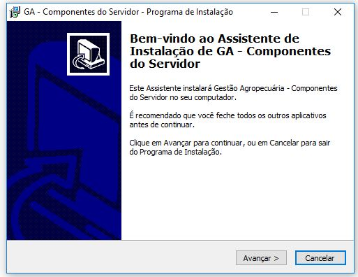
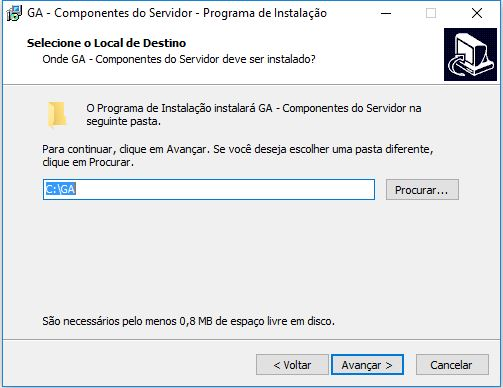
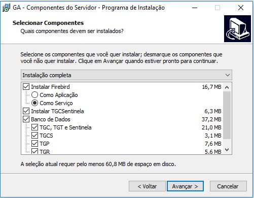
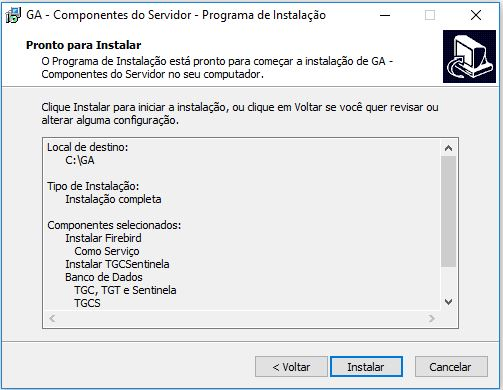
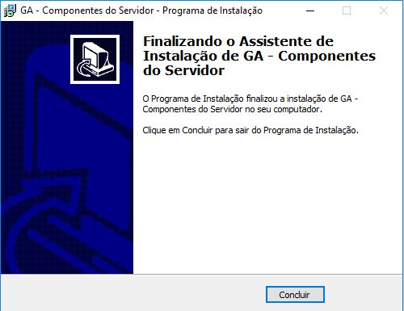

### Instruções de instalação sistema bovino GA (TGR TGC)

**Instalação do aplicativo Gas10**   
**Informações iniciais a respeito do Gas10** 

**Defina o diretório da instalação.**  

**Deixe todas as opções marcadas conforme está na imagem.**  

**Clique em instalar.**

**Clique em concluir para finalizar a instalação.**

